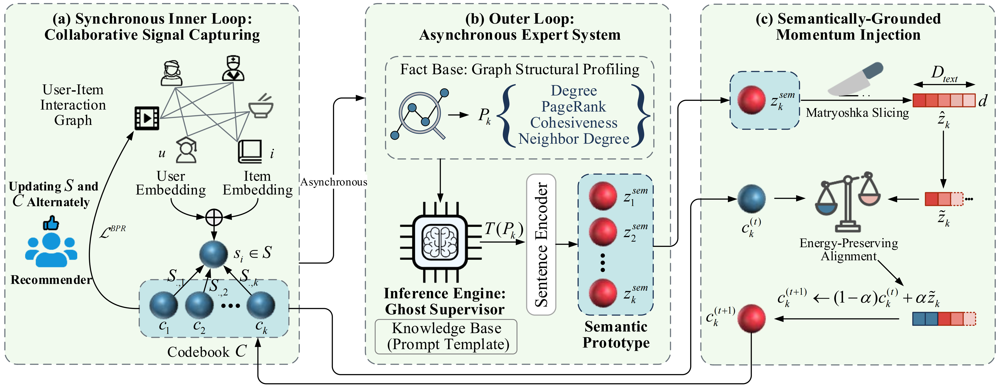

# LS-Meta

This is the PyTorch implementation for **LS-Meta** proposed in the paper **LS-Meta: An LLM-Driven Expert System for Grounding Lightweight Meta-Embeddings in On-Device Recommendation**.

> The paper is currently under review.

## Architecture



## Environments

* python 3.8
* torch
* scipy
* torchfm
* scikit-learn
* tensorboardX
* parse
* sentence_transformers
* ollama
* numpy
* einops

```
curl -fsSL https://ollama.com/install.sh | sh
ollama pull llama3.2:1b
```

## Datasets

| Dataset     |  Users |  Items | Interactions | Density |
| :---        |   ---: |   ---: |         ---: |    ---: |
| Gowalla     | 29,858 | 40,981 |    1,027,370 |  0.084% |
| Yelp        | 71,135 | 45,063 |    1,782,999 |  0.056% |
| Amazon-book | 52,643 | 91,599 |    2,984,108 |  0.062% |

## Model Training

To run the experiments, the scripts we provide can be used directly:

### Run the following command in the Coarse-Grained Training Stage

```python
python engine.py --dataset_name gowalla --res_prepath your_path1 --sign_ft 0
```

### Run the following command in the Fine-Grained Training Stage

```python
python engine.py --dataset_name gowalla --res_prepath your_path2 --sign_ft 1 --init_path_ft your_path1
```

## Acknowledgments
This implementation is based on / inspired by:
* [https://github.com/xurong-liang/LEGCF](https://github.com/xurong-liang/LEGCF) (LEGCF)
* [https://github.com/htyjers/C2F-MetaEmbed](https://github.com/htyjers/C2F-MetaEmbed) (C2F-MetaEmbed)
